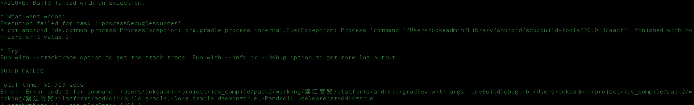
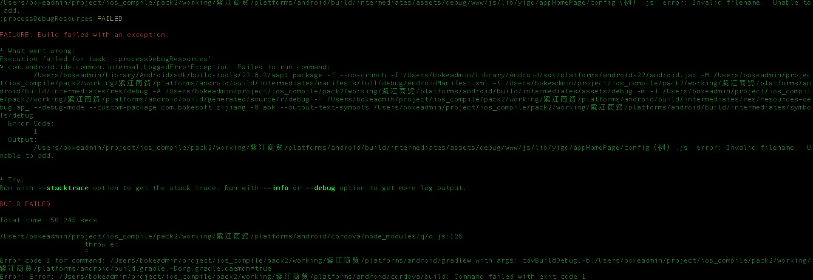

##开头
    今天遇到一个比较特殊的bug。实施人员说,android每次打包都会失败,我去查看了一下错误原因,如下
    


```sh

    FAILURE: Build failed with an exception.
    
    * What went wrong:
    Execution failed for task ':processDebugResources'.
    > com.android.ide.common.process.ProcessException: org.gradle.process.internal.ExecException: Process 'command '/Users/bokeadmin/Library/Android/sdk/build-tools/23.0.3/aapt'' finished with non-zero exit value 1
    
    * Try:
    Run with --stacktrace option to get the stack trace. Run with --info or --debug option to get more log output.
    
    BUILD FAILED
    
    Total time: 51.713 secs
    Error: Error code 1 for command: /Users/bokeadmin/project/ios_compile/pack2/working/紫江商贸/platforms/android/gradlew with args: cdvBuildDebug,-b,/Users/bokeadmin/project/ios_compile/pack2/working/紫江商贸/platforms/android/build.gradle,-Dorg.gradle.daemon=true,-Pandroid.useDeprecatedNdk=true

```

##想法

 - 1.这两天缺失更新了android studio,猜测可能相关的build-tools也进行了更新,然后就一直想办法设置cdvBuildToolsVersion cdvCompileSdkVersion,失败
 - 22.cordova版本问题,打包程序所使用的cordova-lib 和 机器上的cordova版本不一致。跟版本没关系
 - 3.android-target版本问题,由23改为22,终于报出有用的错误信息
 
 
 
 原来是同事使用了中文的文件名的问题。
 
## ~~~~(>_<)~~~~
 
